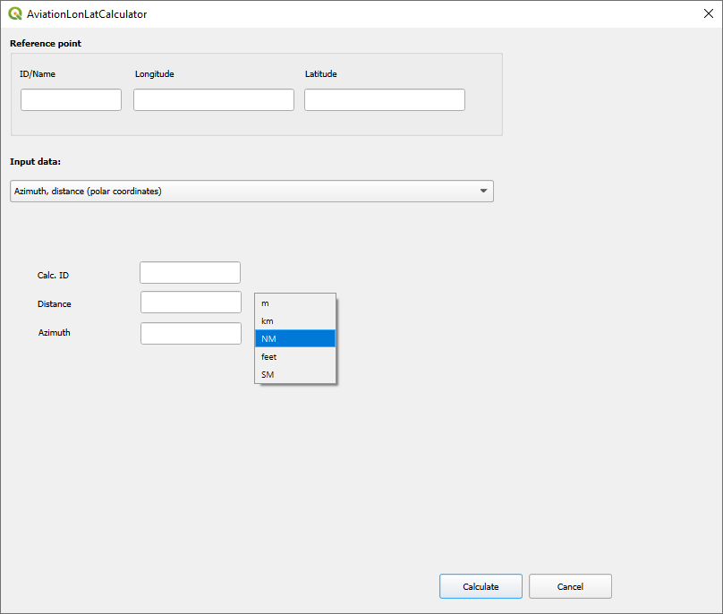
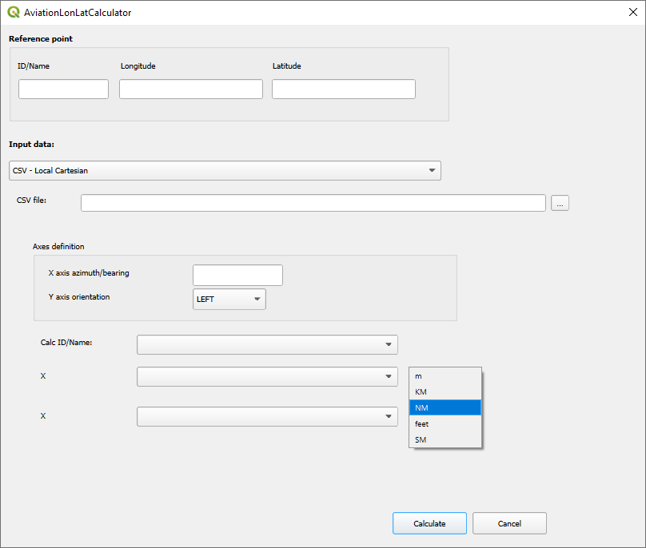

# AviationLonLatCalculator

QGIS plugin to calculate coordinates based on 'aviation-like' point definitions:
* azimuth, distance from reference point
* 'offset' from point defined as azimuth, distance from reference point
* point defined in local cartesian system, defined for example:
  * X, Y axes - runway center line/perpendicular
  * origin: crossing of runway threshold and runway center line

Calculations are supported for:
* single point
* collections of point from CSV files

- [Installation](#installation)
  - [For Git users](#git_user)
  - [For no Git users](#no_git_user)

## For Git users <a name=git_user>

1. Copy repository to the local disk
2. cd dir to the main dir of the `qgis3-aviation-lonlat-calculator` repository
3. Create zip file from the `aviation_lon_lat_calculator` subdirectory
4. QGIS - install plugin via Plugin manager/Installer  
   4.1 Open menu: `Plugins > Manage and Install Plugins`  
   4.2 Choose `Install from ZIP`  
   4.3 Select zip file `aviation_lon_lat_calculator.zip`  
   4.4 Press `Install Plugin button` 
5. Plugin is installed: `Plugins > AviationLonLatCalculator`

## For no Git users <a name=no_git_user>

1. Download repository via `Code > Download ZIP`
2. Unzip to `qgis3-aviation-lonlat-calculator` directory
3. cd dir to the unzipped directory
4. Create zip file from the `aviation_lon_lat_calculator` subdirectory
5. QGIS - install plugin via Plugin manager/Installer  
   5.1 Open menu: `Plugins > Manage and Install Plugins`   
   5.2 Choose `Install from ZIP`  
   5.3 Select zip `aviation_lon_lat_calculator.zip`  
   5.4 Press `Install Plugin button`  
6. Plugin is installed: `Plugins > AviationLonLatCalculator`